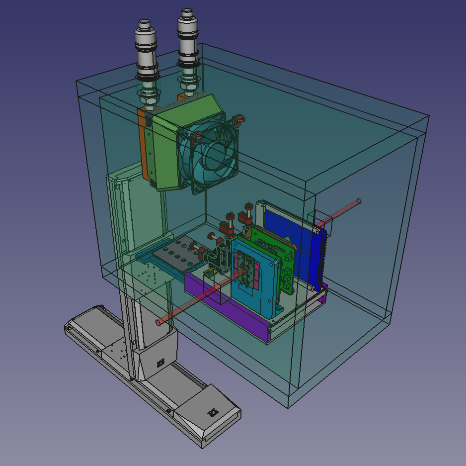
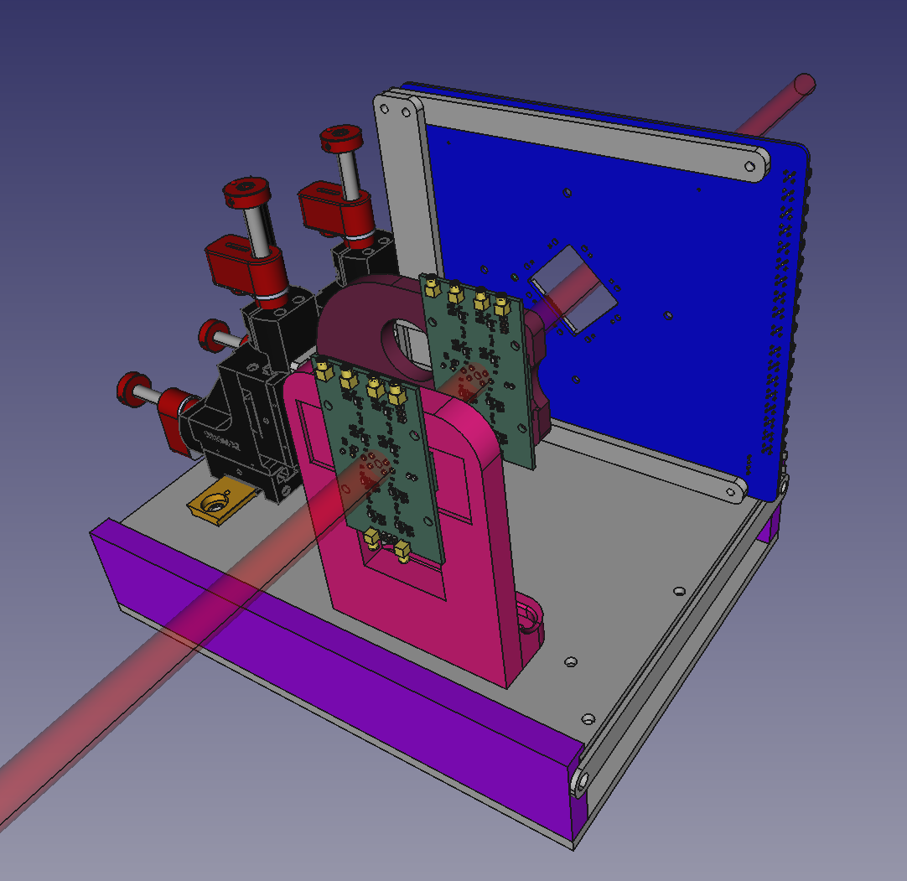

# AIDAinnova TB setup at DESY

This repository contains the files regarding the mechanics of the [AIDAinnova WP6](https://aidainnova.web.cern.ch/wp6) test beam setup at [DESY](https://www.desy.de/). The 3D model was created using [FreeCAD](https://www.freecad.org/).

