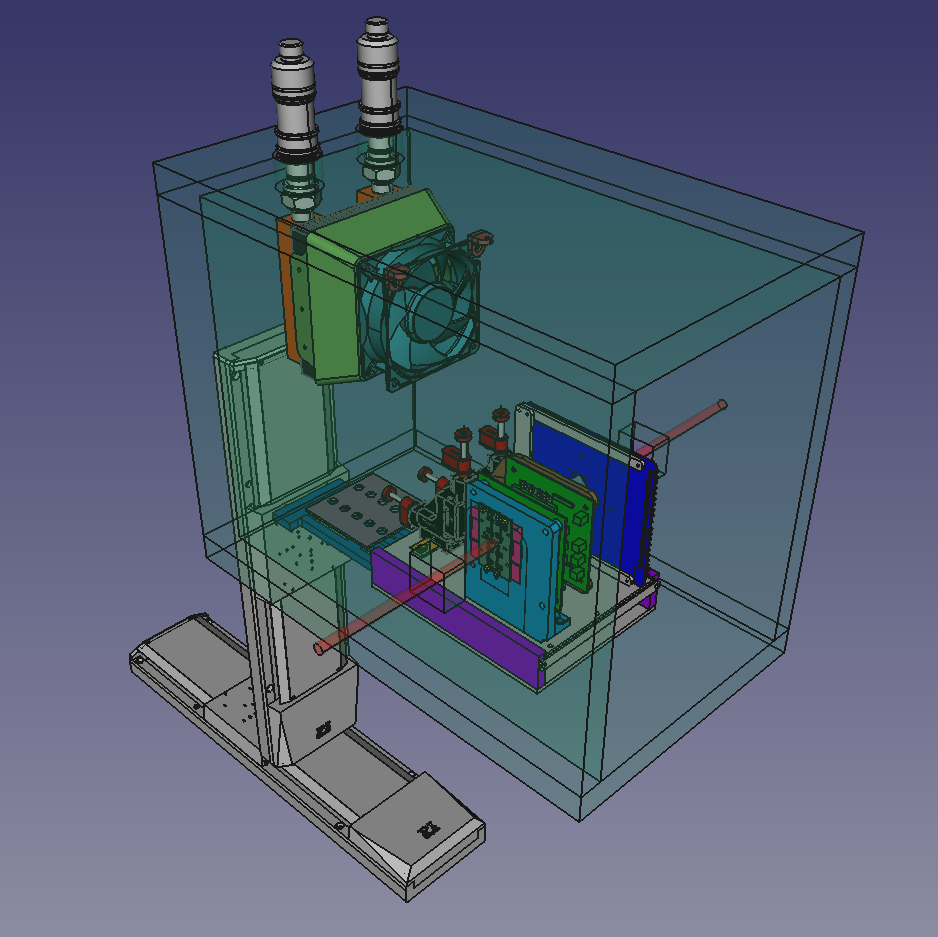
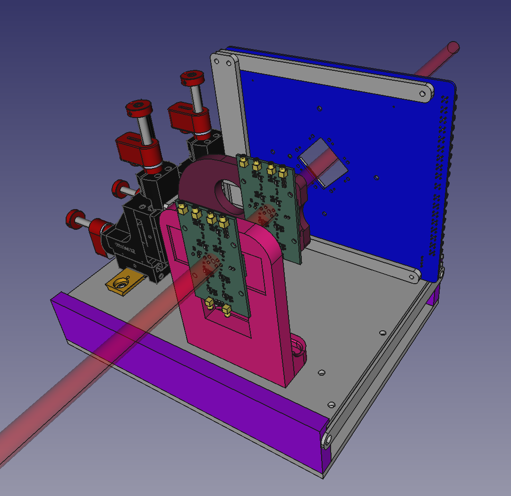

# AIDAinnova TB setup at DESY

This repository contains the files regarding the mechanics of the [AIDAinnova WP6](https://aidainnova.web.cern.ch/wp6) test beam setup at [DESY](https://www.desy.de/). The 3D model was created using [FreeCAD](https://www.freecad.org/). Supports for the [Chubut 2](https://github.com/SengerM/Chubut_2), [Chubut 2 16ch](https://github.com/SengerM/Chubut_2_16CH) and [Santa Cruz Single Channel](https://twiki.cern.ch/twiki/bin/view/Main/UcscSingleChannel) readout boards are available for 3D printing.

